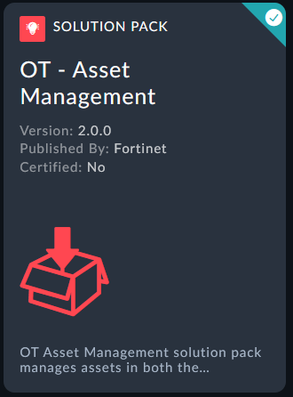

We are going to leverage another solution pack here to demonstrate an OT Use case. Imagine a scenario where you are a network supervisor for
We want to install a FortiSOAR communications if not already setup. If this is already setup or you are in an environment with different mail server options then you can just use this as a review to your communication configuration.

---

## Install Solution Pack

- On the left Navigation Pane, go to **Content Hub**. 
- In the Discover Tab search for **OT - Asset Management**.

{}
The Content Hub has a minimum requirement of 3 characters so make sure to not only type "**OT**"
{}

- Open the **OT - Asset Management** Solution Pack.
- On the right pane, Click the install icon -  - to install the Solution Pack. Click the **Confirm** button if there is a popup to confirm the installation

- Wait for the solution pack to finish installing

{}
This solution pack has 4 dependencies. Solution packs often build upon other solution packs for increased functionality.
{}

- Once the installation is complete you'll see the Solution pack has a green checkmark at the corner

