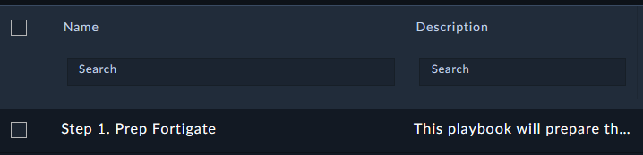
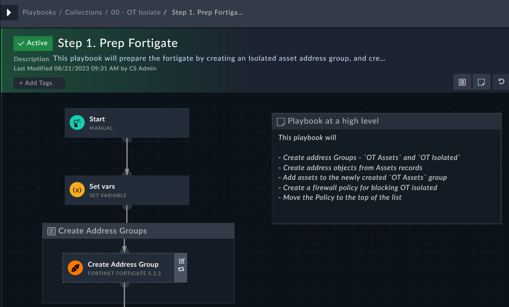
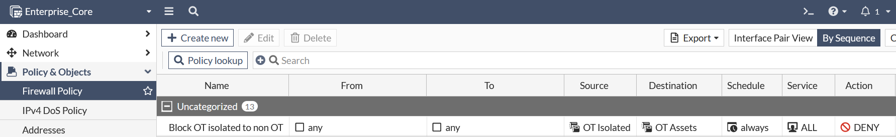
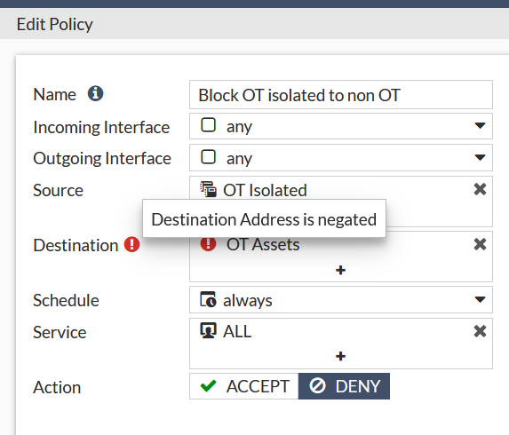

The new OT collection has a playbook that will configure multiple things on the **Enterprise Core** FortiGate. This work has been done ahead of time to speed up the workshop.

In OT environments there is heavy red tape around blocking new traffic. In short, all OT devices *must* be able to communicate to other OT devices. If there is malware identified on an OT device, the spread should be *mitigated* and not blocked outright. This is what the policy above does. The policy will *only* allow **isolated** OT assets to communicate to devices in the OT Assets group, and nothing else.

---

## Run the playbook

1. Open the playbook **Step 1. Prep FortiGate**

1. Observe the steps in the playbook. It is documented with the tasks it will perform

1. Run the playbook by clicking the start button 
1. Click Trigger Playbook to confirm

## Confirm the changes on the FortiGate

1. Access the FortiGate by clicking on the **Enterprise_Core** **HTTPS** button from your demo instance or by browsing to `https://<your instance>.fortidemo.fortinet.com:14002/` 

1. Navigate to **Policy & Objects > Firewall Policy**
1. Confirm that you see a new policy at the top

1. Edit the policy **Block OT isolated to non OT**

{} This policy is a destination address negate policy.
{}
