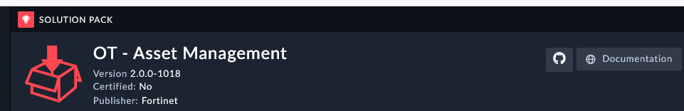
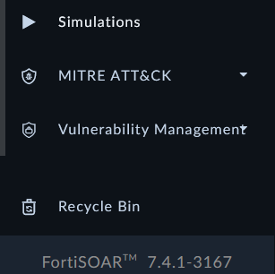
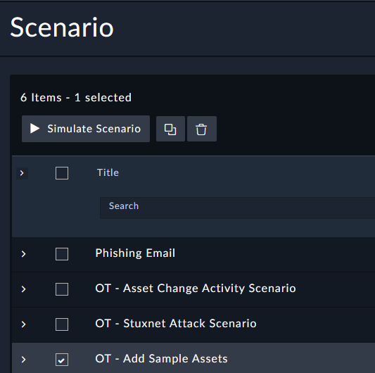
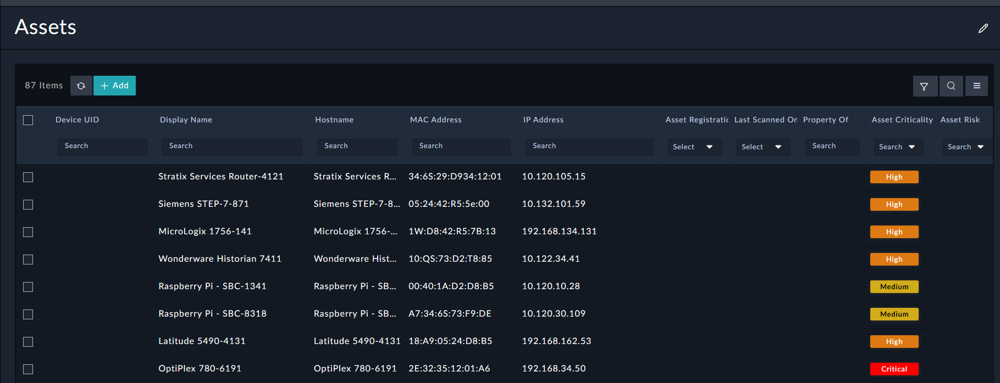

The **OT - Asset Management Solution** pack installs more scenarios for us to try out. Feel free to check out the documentation link for the solution pack which leads to FortiSOAR's Github page to see the full potential of this pack.

---

## Run an OT Scenario

This scenario generates 87 IT/OT assets as per the Purdue model based on various criticality levels, types, and other asset categorizations as sample data. To run this scenario and generate the assets, perform the following steps

1. Under FortiSOAR's left navigation panel, select the **Simulations** entry.

1. Select the checkbox on the **OT - Add Sample Assets** Scenario Record.

1. Click **Simulate Scenario**.

1. To view the added sample assets, hover over **Resources** under the FortiSOAR's left navigation panel, and select **Assets**

1. Confirm you see new Asset records in the module
{}
Do not proceed to the next section until the assets are done creating. It may take around a minute for the simulation to complete.
{}

