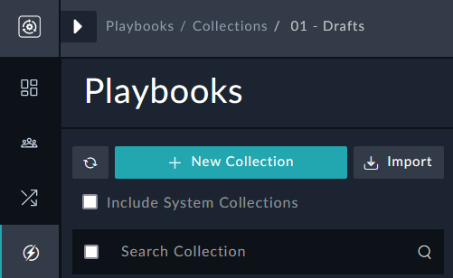
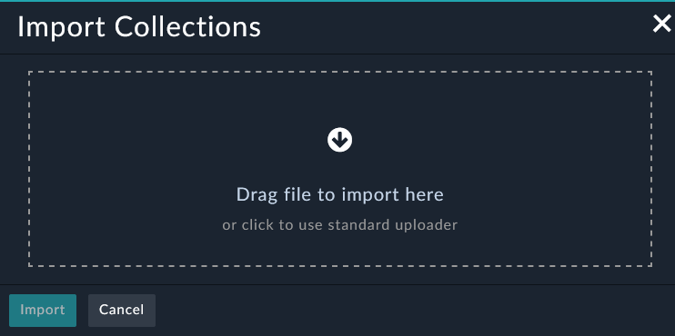
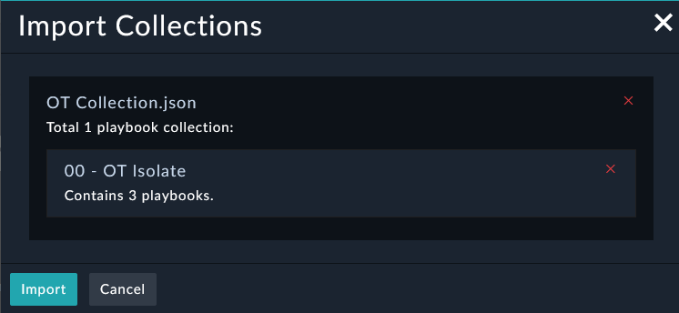
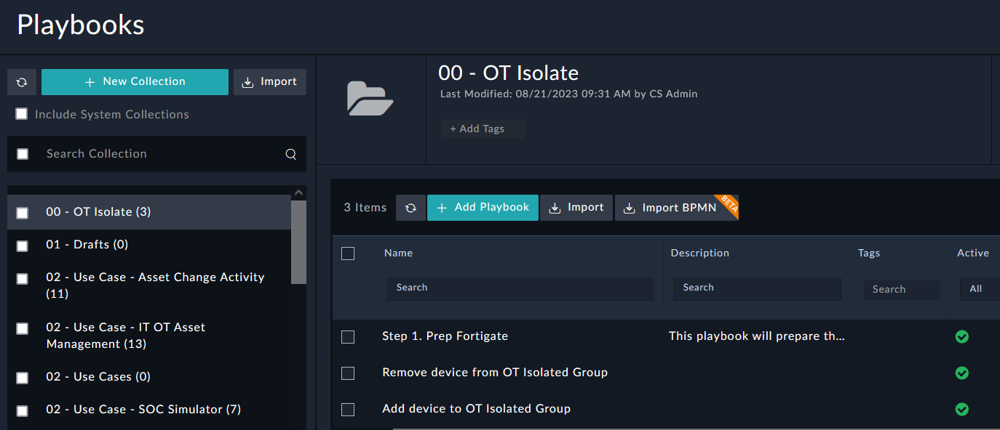

Earlier in this lab guide we have shown multiple ways to use new solutions in FortiSOAR: Using the Import Wizard and installing Solution Packs. In this section we're going to show how to import a Playbook Collection.

---

## Download the Playbook Collection

1. Download the Playbook Collection {}Here{}
{}
If the file doesn't auto download after clicking the `Here` button, like in Firefox, click the save button and download the file

{}
2. Navigate to **Automation > Playbooks**
3. Click the **Import** button at the top left.

1. Drag the file inside the dashed square, or click inside and select the required file.

1. Click the import button

1. You will now have a new Collection **00 - OT Isolate**

