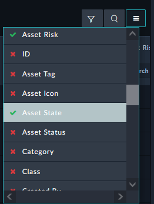
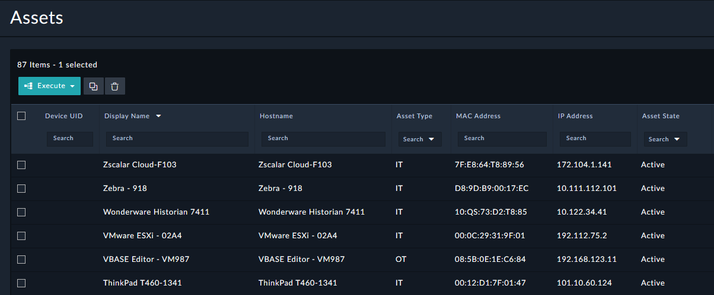
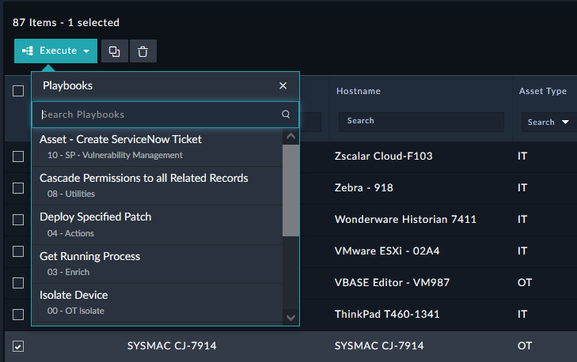
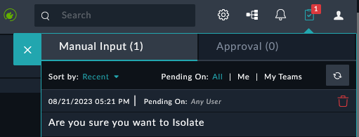
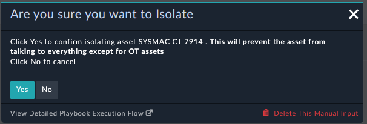
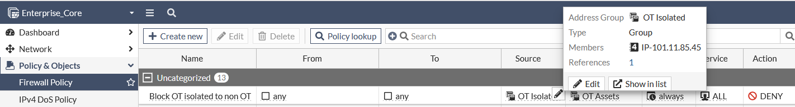

We will now use the other imported playbooks in this Chapter by running them against an alert

---

## Navigate and Fix Columns

1. Navigate to **Resources > Assets**

1. Click the Hamburger icon on the top row of the grid  , look for the field **Asset State** and click it.

{}
You may need to zoom out from your browser to see the column. You can click and hold the column name and drag it to move the column to the left or right of other columns
{}

1. Once done your columns should look something like the image below

## Isolate a Device

1. Select the checkbox of any Asset record with **Asset Type** of **OT**
1. Click the Execute button and Click **Isolate Device**

1. Click the clipboard icon at the top right
1. Click the text **Are you sure you want to isolate**

1. Click yes to confirm isolating the playbook

{}
What happens when you try execute the **Isolate Device** playbook on a **Asset** that has the type **IT** ?
{}

## Check the Results

1. Access the FortiGate by clicking on the **Enterprise_Core** **HTTPS** button from your demo instance or by browsing to `https://<your instance>.fortidemo.fortinet.com:14002/` 

1. Navigate to **Policy & Objects > Firewall Policy**
2. Hover over the **OT Isolated** group to confirm you see the IP of the asset you isolated previously

