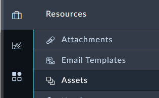
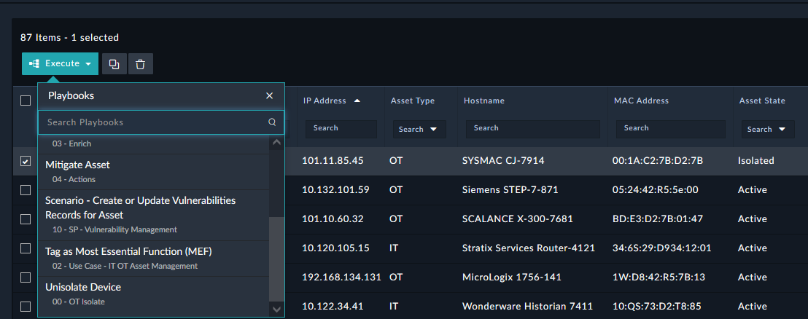
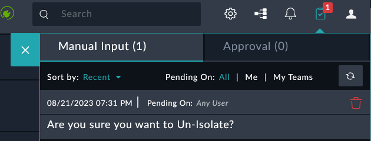
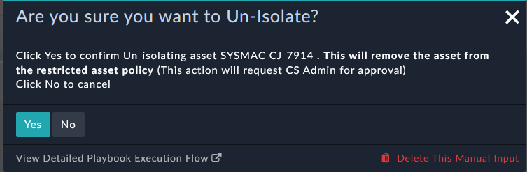
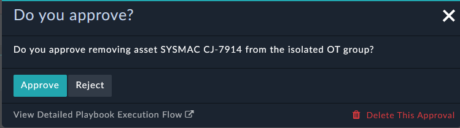
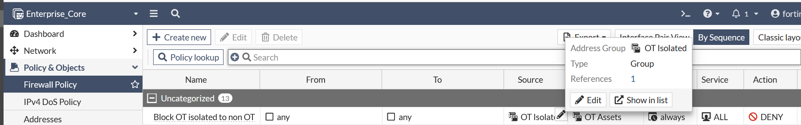

Finally, we have build out a process to remove an Asset from the OT Isolated Group on the Enterprise Core FortiGate. In this scenario, the Network team's process for removing an isolated device through automation will require a manager's approval. The playbook has a static value of "CS Admin" set, but this could be any user or Team in FortiSOAR, or even a user outside of FortiSOAR.

---

## Un-Isolate the Asset

1. Navigate to **Resources > Assets**


1. Select the checkbox of the Asset record with **Asset Type** of **OT** , that has the **Asset State** of Isolated.
1. Click the Execute button and Click **Unisolate Device**


{}
Make sure that the asset you've selected is in fact an **OT** Type, and previously **Isolated**. Playbooks can have visibility conditions to prevent them from being activated incorrectly.
{}

1. Click the clipboard icon at the top right
1. Click the text **Are you sure you want to Un-Isolate?**

1. Click yes to confirm isolating the playbook


1. If you are signed into FortiSOAR as `csadmin`, you will receive an additional pop up asking you to approve the request. If you do not see this pop up, sign out of FortiSOAR and sign in with csadmin/```$3curityFabric```


1. Approve the request

## Check the Results

1. Access the FortiGate by clicking on the **Enterprise_Core** **HTTPS** button from your demo instance or by browsing to `https://<your instance>.fortidemo.fortinet.com:14002/` 

1. Navigate to **Policy & Objects > Firewall Policy**
1. Hover over the **OT Isolated** group to confirm you do not see the IP of the asset you Un-Isolated


---

### Bonus Points :money_with_wings:

- If you are able identify where in the Un-Isolate playbook you could modify the approval to be Soc User1 instead of csadmin
